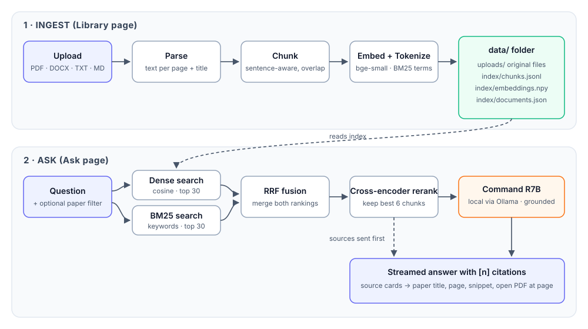

# ResearchRAG

A small, fully local Retrieval-Augmented Generation app for research papers.
Upload your papers on one page, ask questions on another, and get answers grounded
in *your* library — every claim linked back to the paper and page it came from.

No paid APIs. Embeddings, reranking and generation all run on your machine.



## How it works

**Ingest (Library page)**

1. You drop in PDFs, DOCX, TXT or Markdown files.
2. Text is extracted page by page (so citations can point to a page) and the paper title is detected.
3. Pages are split into ~220-word, sentence-aware chunks with a small overlap.
4. Each chunk gets a dense embedding (`BAAI/bge-small-en-v1.5`) and BM25 keyword terms.
5. Everything is persisted as plain files under `data/` — no database to run.

**Ask (Ask page)**

1. Your question is searched two ways: dense (semantic) and BM25 (exact terms, acronyms, formulas).
2. The two rankings are merged with Reciprocal Rank Fusion.
3. A cross-encoder (`cross-encoder/ms-marco-MiniLM-L-6-v2`) rereads the top candidates against the question.
   Only passages it scores **≥ 30% relevant** are kept (up to 6). If none qualify, the LLM isn't called at all —
   you get a "nothing relevant found" message instead of a stretched answer.
4. Those chunks go to **Cohere Command R7B** running locally in Ollama, which answers using only the sources and cites them as `[1]`, `[2]`…
5. The UI streams the answer and shows a source card per citation: paper, page, relevance, snippet, and a link that opens the PDF at that page.

If Ollama isn't running you still get the reranked passages with citations — retrieval never depends on the LLM.

## Why these choices

| Piece | Choice | Reason |
|---|---|---|
| Retrieval | Hybrid dense + BM25 | Dense handles paraphrase, BM25 catches exact terms like "BERT-large" or "Eq. 3". |
| Fusion | RRF (k=60) | Rank-based, so no score calibration between the two retrievers. |
| Rerank | Cross-encoder | Scores query and chunk together — much sharper than bi-encoder similarity. |
| Cutoff | Reranker probability ≥ 0.30 | Cosine scores from bge are compressed (unrelated text often scores 0.6+), so the calibrated reranker score is what gets thresholded. |
| LLM | Command R7B (Ollama) | 7B model trained for grounded RAG with citations, runs on a laptop. |
| Storage | `.npy` + `.jsonl` files | Transparent, portable, fast enough for thousands of papers. |
| API/UI | FastAPI + vanilla JS | Two clean pages, zero build step. |

## Project layout

```
ResearchRAG/
├── app/
│   ├── main.py        # FastAPI routes + static pages
│   ├── config.py      # settings (env overridable)
│   ├── ingest.py      # parsing + chunking
│   ├── models.py      # embedder + reranker (lazy loaded)
│   ├── store.py       # on-disk index, doc registry
│   ├── bm25.py        # small BM25 implementation
│   ├── retriever.py   # hybrid search, RRF, rerank
│   └── llm.py         # prompt + Ollama streaming client
├── web/               # Library + Ask pages (HTML/CSS/JS)
├── tests/             # pipeline tests (no model downloads needed)
├── data/              # created at runtime: uploads/ and index/
├── docs/architecture.svg
├── requirements.txt
└── run.sh
```

## Setup

Requirements: Python 3.9+, [Ollama](https://ollama.com), ~6 GB free disk for the models.

```bash
git clone <this-repo> && cd ResearchRAG
./run.sh
```

On first run, `run.sh` creates the virtualenv, installs dependencies, copies `.env.example` to `.env`,
starts Ollama if needed and pulls the configured LLM. Open http://localhost:8000 — **Library** to upload, **Ask** to query.

The embedding and reranker models (~200 MB total) download automatically on first start.

<details>
<summary>Manual setup (without run.sh)</summary>

```bash
cp .env.example .env               # optional — every setting has a default
ollama pull command-r7b
python3 -m venv .venv && source .venv/bin/activate
pip install -r requirements.txt
uvicorn app.main:app --reload
```
</details>

## Configuration

Defaults live in `app/config.py`. To change them, edit your local `.env`
(it's gitignored — `.env.example` is the committed template, and `run.sh` creates `.env` from it on first run).
Any of these can also be set for a single run from the shell, which takes priority over `.env`:

```bash
RAG_LLM_MODEL=llama3.1:8b ./run.sh
```

| Variable | Default |
|---|---|
| `RAG_DATA_DIR` | `./data` |
| `RAG_EMBED_MODEL` | `BAAI/bge-small-en-v1.5` |
| `RAG_RERANK_MODEL` | `cross-encoder/ms-marco-MiniLM-L-6-v2` |
| `RAG_LLM_MODEL` | `command-r7b` |
| `OLLAMA_URL` | `http://localhost:11434` |
| `RAG_CHUNK_WORDS` / `RAG_CHUNK_OVERLAP` | `220` / `40` |
| `RAG_TOP_K` | `6` (max sources per answer) |
| `RAG_MIN_RELEVANCE` | `0.30` (reranker cutoff, adjustable per question in the UI) |

## Switching models

All three models are set in your local `.env` (created from `.env.example` on first run — see [Configuration](#configuration)).
Restart the app after changing them. When you want a new default for everyone who clones the repo,
change `.env.example` instead.

**LLM (answers):** safe to change any time, no re-indexing.

```bash
# in .env
RAG_LLM_MODEL=qwen2.5:14b          # or command-r (35B), llama3.1:8b, mistral-nemo ...
```

`./run.sh` pulls the model if it isn't downloaded yet (or run `ollama pull qwen2.5:14b` yourself).

Rough guide for Apple Silicon: 7–8B models run on 16 GB, 14B needs ~24 GB, 32–35B needs 32 GB+.
The header pill shows whether the model is pulled and ready.

**Reranker:** safe to change any time. Stronger (slower) option:

```bash
RAG_RERANK_MODEL=BAAI/bge-reranker-base      # or BAAI/bge-reranker-v2-m3 for multilingual papers
```

A different reranker scores on a slightly different scale, so recheck the 30% threshold in the UI.

**Embeddings:** vectors from different models can't be mixed, so rebuild the index after switching:

```bash
# .env
RAG_EMBED_MODEL=BAAI/bge-base-en-v1.5        # or BAAI/bge-large-en-v1.5
# stop the server, then
python -m app.reindex                        # re-embeds every uploaded paper, keeps titles
```

If you forget, the app refuses to start and tells you to run the command above.

## API

| Method | Path | Purpose |
|---|---|---|
| `POST` | `/api/documents` | upload one or more files |
| `GET` | `/api/documents` | list indexed papers |
| `DELETE` | `/api/documents/{id}` | remove a paper and its chunks |
| `GET` | `/api/documents/{id}/file` | original file (append `#page=N` for PDFs) |
| `POST` | `/api/search` | retrieval only → ranked, cited chunks |
| `POST` | `/api/ask` | streamed answer (NDJSON: `sources`, `token`, `done`) |
| `GET` | `/api/health` | index stats + LLM availability |

## Tests

```bash
pytest -q
```

Tests use a tiny hashing embedder, so they run offline in seconds.

## Roadmap

- Scanned PDF support via OCR
- Per-paper summaries and "compare these two papers"
- Export answers with a formatted bibliography (BibTeX / APA)
